# README

This repo is a clone of
https://github.com/varadbhogayata/varadbhogayata.github.io 

## Activity 1 - Screenshot of repo
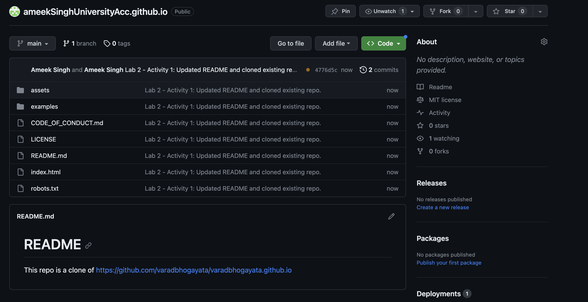

## Activity 2
>References for images:
>React logo: https://upload.wikimedia.org/wikipedia/commons/thumb/a/a7/React-icon.svg/2300px-React-icon.svg.png
>HelloFresh logo: https://upload.wikimedia.org/wikipedia/commons/thumb/b/bc/HelloFresh_Logo_2020.png/1200px-HelloFresh_Logo_2020.png
>JavaScript logo: https://upload.wikimedia.org/wikipedia/commons/thumb/6/6a/JavaScript-logo.png/800px-JavaScript-logo.png
>Rust logo: https://upload.wikimedia.org/wikipedia/commons/thumb/d/d5/Rust_programming_language_black_logo.svg/1024px-Rust_programming_language_black_logo.svg.png
>C++ logo: https://upload.wikimedia.org/wikipedia/commons/thumb/1/18/ISO_C%2B%2B_Logo.svg/1822px-ISO_C%2B%2B_Logo.svg.png
>C logo: https://upload.wikimedia.org/wikipedia/commons/1/19/C_Logo.png
>MongoDB logo: https://upload.wikimedia.org/wikipedia/commons/thumb/9/93/MongoDB_Logo.svg/2560px-MongoDB_Logo.svg.png
>React Native logo: https://camo.githubusercontent.com/402b277553c58de02d809e2edeacf5cf07cc31cf59fe01cfc6ef64e0616c4cdb/68747470733a2f2f746f70706e672e636f6d2f75706c6f6164732f707265766965772f72656163742d6e61746976652d7376672d7472616e73666f726d65722d616c6c6f77732d796f752d696d706f72742d7376672d61706572747572652d736369656e63652d696e6e6f7661746f72732d6c6f676f2d31313536323835313939347a716370776f7a7376792e706e67

### Screenshots:
#### Homepage:
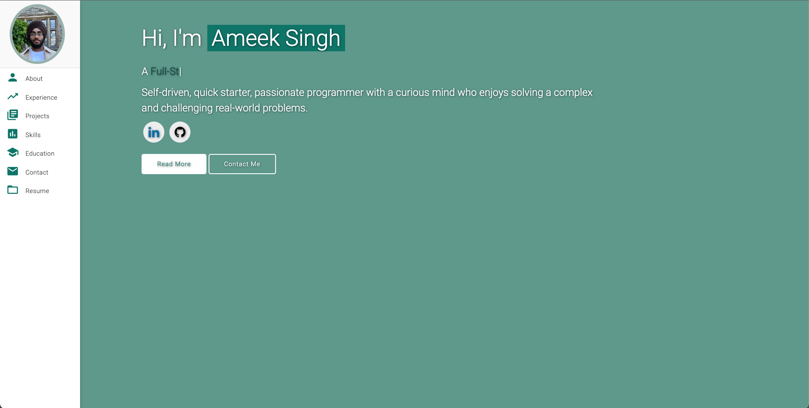
#### About + Experience:
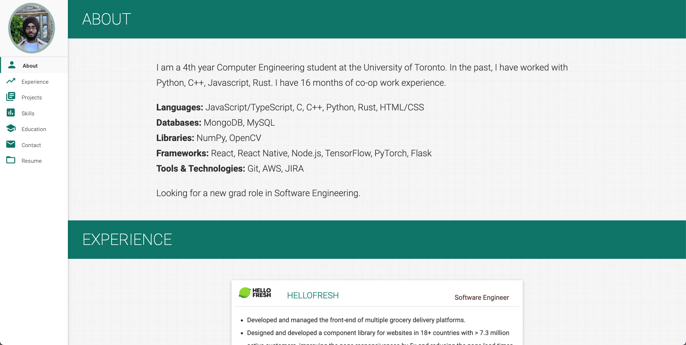
#### Experience:
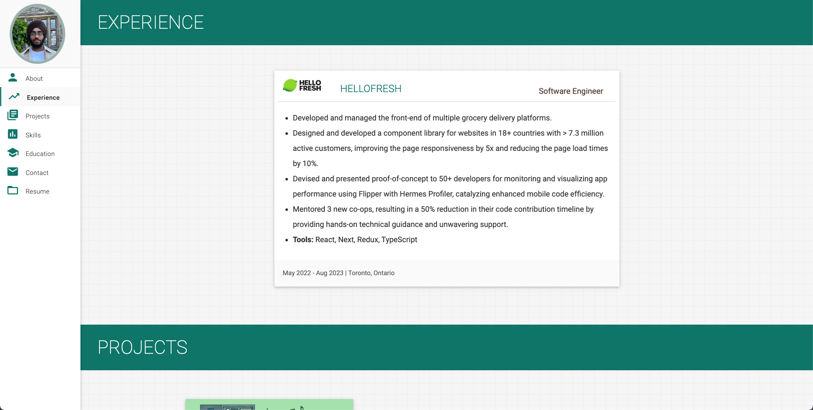
#### Projects:
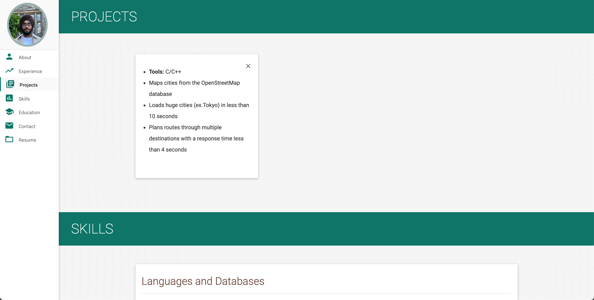
#### Skills:
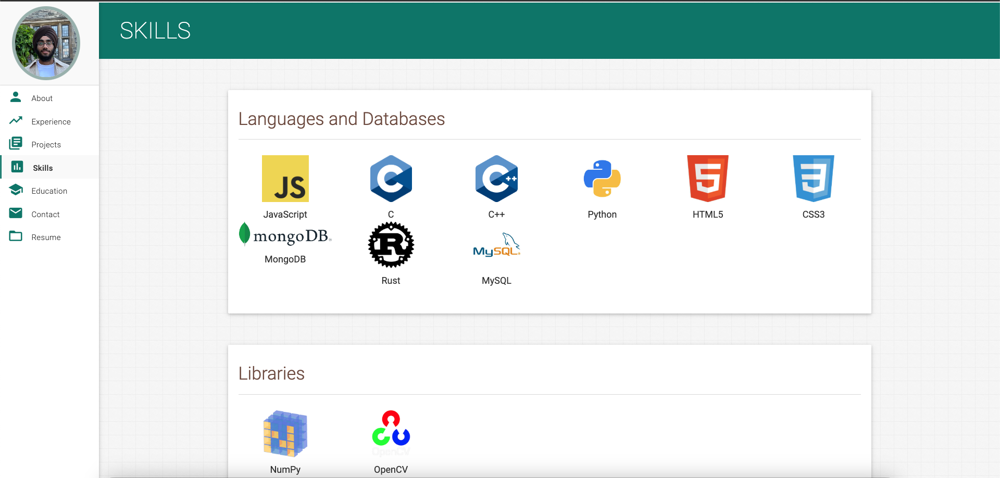
#### Education + Contact:
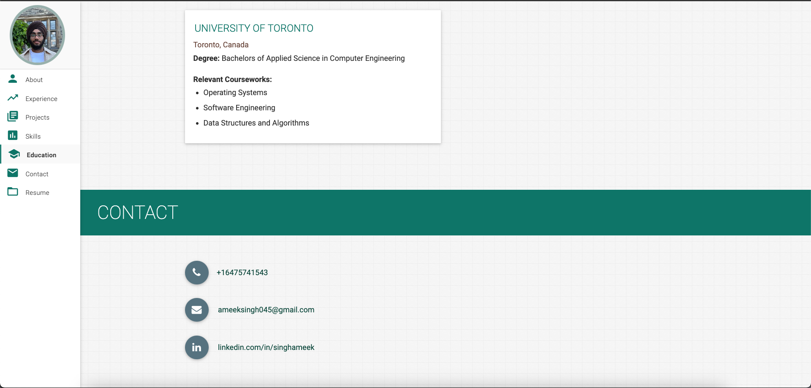
#### Repo:
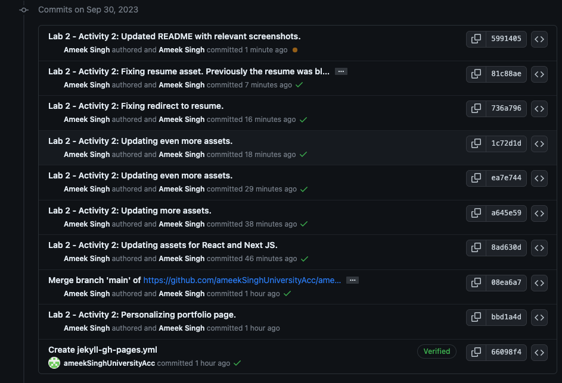
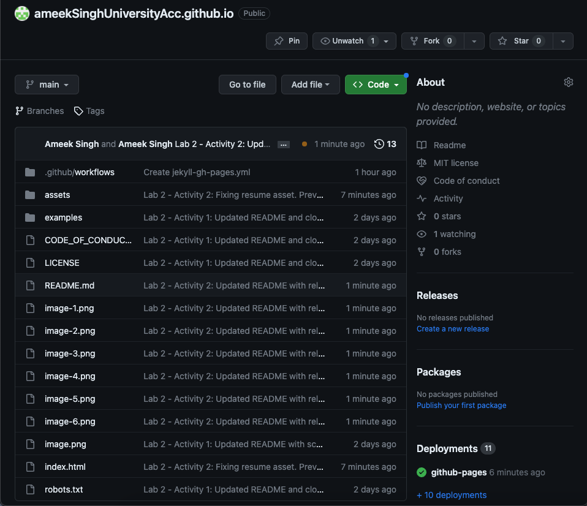

## Activity 3:
### Screenshots:
#### Website - homepage:
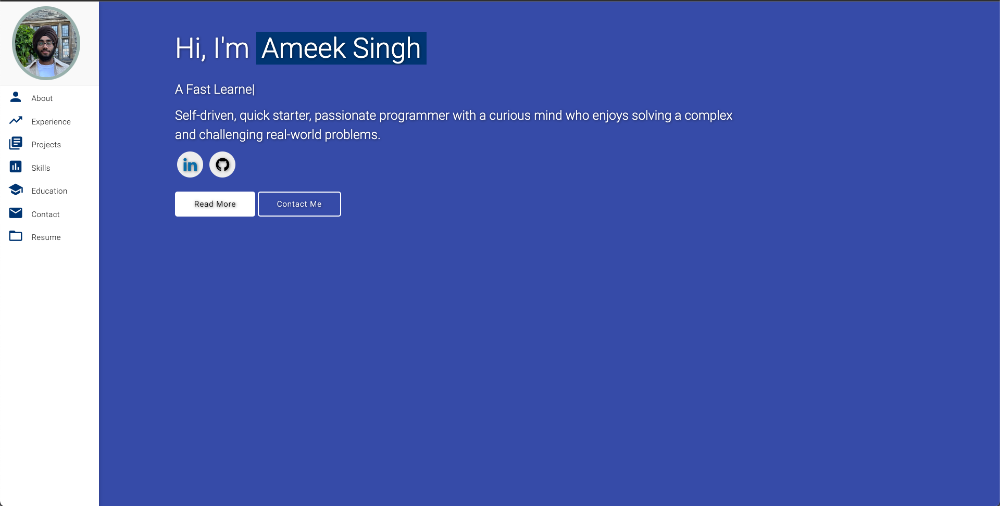

#### Repo:
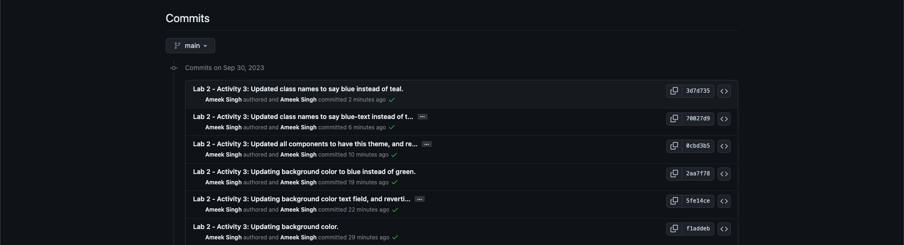
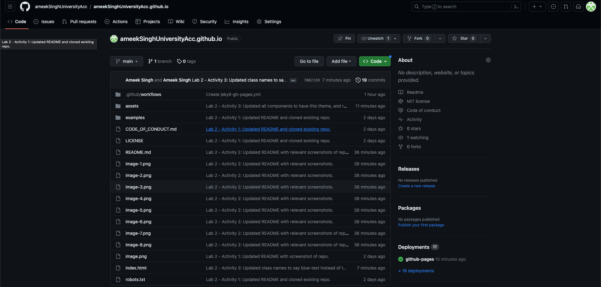